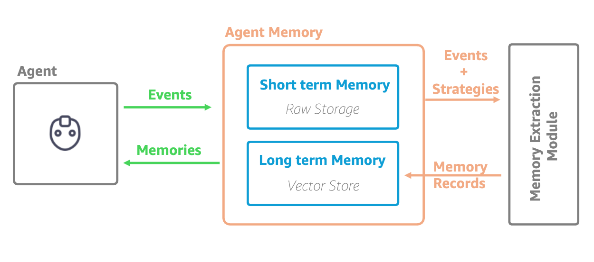

# Getting started with AgentCore memory

## Architecture



AgentCore memory has two layers:

- **Short-term memory** (raw event storage) — every conversation turn is written as an event scoped to an actor and session, giving the agent low-latency access to the current context without any background processing.
- **Long-term memory** (vector store) — a background memory Extraction Module processes events using configurable strategies (semantic, summary, user preference, episodic, or self-managed) to produce structured, semantically-searchable memory records that persist across sessions.

The agent writes events to short-term memory and reads back memory records extracted into long-term memory. Both layers share the same memory resource and namespace hierarchy.

---

Start here if you are new to AgentCore memory. This folder teaches the vocabulary, helps you pick an access surface (CLI, boto3, or AgentCore SDK), then walks the same end-to-end flow three ways so you can follow it with whichever surface you prefer.

| Step | File | What you learn |
|---|---|---|
| 1 | [01-memory-concepts.md](./01-memory-concepts.md) | Actor, session, event, strategy, namespace, memory record |
| 2 | [02-choosing-your-surface.md](./02-choosing-your-surface.md) | When to use the CLI vs boto3 vs the AgentCore SDK |
| 3a | [03-quickstart-cli.md](./03-quickstart-cli.md) | End-to-end flow with the AWS CLI |
| 3b | [04-quickstart-boto3.py](./04-quickstart-boto3.py) | Same flow with raw `boto3` clients |
| 3c | [05-quickstart-agentcore-sdk.py](./05-quickstart-agentcore-sdk.py) | Same flow with the `MemoryClient` from the AgentCore SDK |

All three quickstarts build the same resource, write the same event, add the same built-in strategy, and retrieve the same record — so you can switch surfaces without relearning the model.

## Where to go next

Once you have the concepts and a working quickstart:

- **Short-term memory primitives** → [`../01-short-term-memory/`](../01-short-term-memory/)
- **Long-term memory primitives** → [`../02-long-term-memory/`](../02-long-term-memory/)
- **Framework integrations (Strands, LangGraph, LlamaIndex)** → `examples/{single-agent,multi-agent}/` under each memory type
- **Integrations (runtime, identity, Guardrails, Browser)** → [`../03-integrations/`](../03-integrations/)
- **Observability (CloudWatch metrics + logs)** → [`../04-observability/`](../04-observability/)
- **Security patterns (IAM, Cognito, KMS)** → [`../05-security/`](../05-security/)

## Running the Python Scripts

Run each script directly with Python:

```bash
python 04-quickstart-boto3.py
python 05-quickstart-agentcore-sdk.py
```
