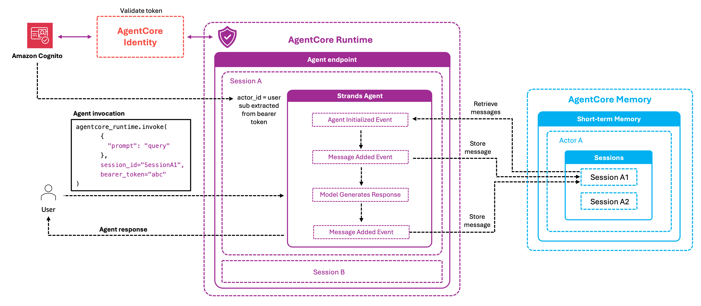

# Runtime + Memory + Cognito identity

Adds a Cognito JWT authorizer to the runtime endpoint so memory operations are scoped to the authenticated user. The user's Cognito `sub` becomes the `actorId`, giving each user an isolated slice of the same memory resource.

## What you learn

- Configure a Cognito User Pool and a JWT authorizer on the runtime endpoint
- Extract the user's `sub` from the JWT claims and use it as `actorId` for every memory operation
- Verify per-user isolation — two different users on the same memory resource never see each other's events

## Architecture



A request hits the runtime endpoint with a Cognito-issued JWT. The runtime validates the token, exposes the user's claims to the agent, and the agent uses `claims["sub"]` as the `actorId` on every `CreateEvent` / `RetrieveMemoryRecords` call.

## Run

```bash
pip install -r requirements.txt
python runtime_memory_identity_integration.py
```

The script provisions the Cognito User Pool, creates the memory resource, deploys the agent container with the JWT authorizer attached, and invokes the endpoint as two separate users to verify isolation.

## Best practices

- **Use the Cognito `sub` (not `username` or `email`) as `actorId`.** It's the only stable, immutable identifier — usernames and emails can change.
- **Validate the JWT in the authorizer, not the agent.** AgentCore's JWT authorizer enforces signature/expiry; don't re-implement that in application code.
- **Combine with IAM scoping** for defence in depth — even if a bug in the agent passes the wrong `actorId`, an IAM condition on `bedrock-agentcore:actorId` will block the call. See [`../../05-security/01-iam-scoped-access/`](../../05-security/01-iam-scoped-access/).
- **Multi-tenant?** Prefix actor ids with the tenant (`acme/{sub}`) and condition IAM on the prefix — see [`../../01-short-term-memory/03-actor-session-isolation/`](../../01-short-term-memory/03-actor-session-isolation/).

## Where to go next

- Issue per-user temporary credentials via Cognito Identity Pools: [`../../05-security/02-cognito-federated-identity/`](../../05-security/02-cognito-federated-identity/)
- Layer Bedrock Guardrails on top: [`../03-guardrails-integration/`](../03-guardrails-integration/)
