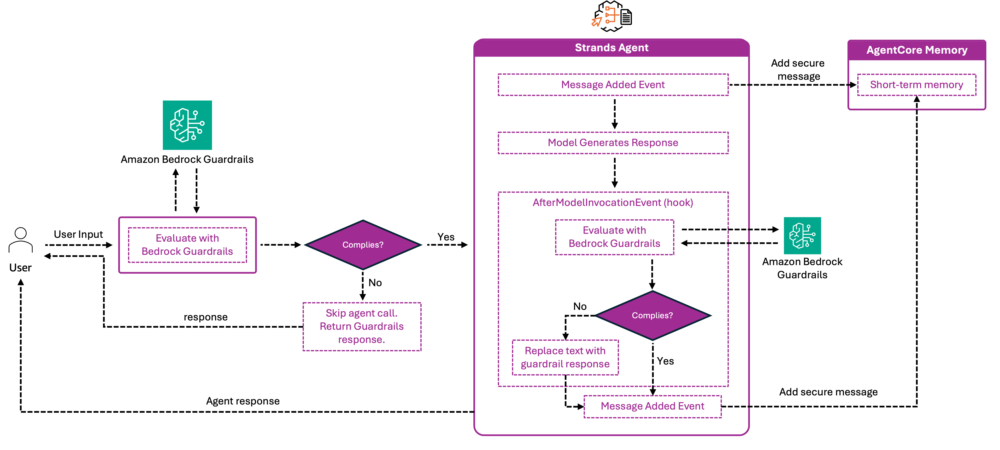

# Memory + Bedrock Guardrails

Wrap memory save / retrieve in Amazon Bedrock Guardrails so sensitive content is filtered both on the way in and on the way out. Useful when memory carries free-form user input or when downstream consumers must never see PII or unsafe content.

## What you learn

- Apply a Bedrock guardrail to user input before saving it to memory
- Apply the same guardrail to retrieved memory content before injecting it into the LLM context
- Build a custom hook that fuses guardrail evaluation with memory save/retrieve so the agent only ever sees safe content

## Architecture



Every save is gated by an input guardrail; every retrieve is gated by an output guardrail. Blocked content is dropped (or replaced with the guardrail's masked output) before the agent sees it.

## Run

```bash
pip install -r requirements.txt
python guardrails-memory.py
```

The script creates a guardrail with content filters and PII detection, creates a memory resource, drives a conversation containing both safe and unsafe inputs, and shows that only the safe content survives the round-trip.

## Best practices

- **Filter at both boundaries.** Filtering only inputs leaves stale unsafe content in memory; filtering only outputs leaks PII into storage. Do both.
- **Pick a guardrail tier matching the workload.** A general-purpose chat agent and a healthcare agent need different policy strengths.
- **Watch for false positives in retrieval.** Aggressive guardrails can suppress relevant memory content; tune content filter strength on a representative dataset.
- **Don't store guardrail-blocked text and try to "filter it out later."** Once it's in memory, retrieval can leak it through edge cases. Filter before `CreateEvent`.
- **Log guardrail decisions.** Surface blocks in CloudWatch so you can distinguish a memory miss from a guardrail block during debugging.

## Where to go next

- Memory observability and CloudWatch metrics: [`../../04-observability/`](../../04-observability/)
- Production identity isolation: [`../02-identity-integration/`](../02-identity-integration/)
