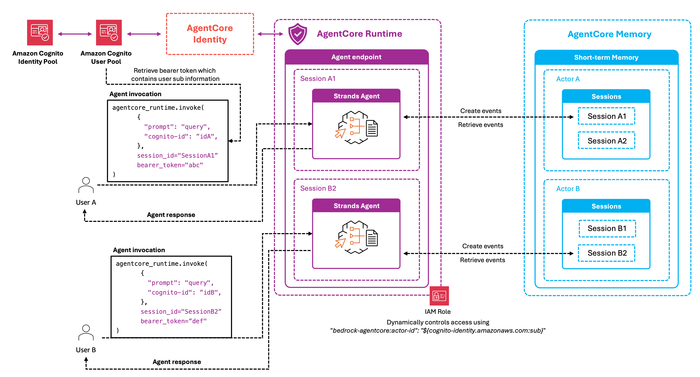

# Cognito federated-identity isolation

Exchange a Cognito ID token for short-lived AWS credentials via a Cognito Identity Pool, then call AgentCore Memory with those per-user credentials. The user's `identityId` is the `actorId`, and the Identity Pool's authenticated role governs what each user can do — no application-layer `actorId` enforcement required.

Compared to [`../01-iam-scoped-access/`](../01-iam-scoped-access/), this approach binds identity to the credential itself: there is no shared service role that could be tricked into reading another user's data.

## What you learn

- Set up a Cognito User Pool + Identity Pool with `AssumeRoleWithWebIdentity`
- Exchange a Cognito ID token for temporary AWS credentials at invocation time
- Call AgentCore Memory using those credentials so identity is enforced by IAM, not by app code
- Verify isolation — each user's credentials can only operate on their own `identityId` namespace

## Architecture



The user authenticates against the Cognito User Pool, receives a JWT, exchanges it at the Identity Pool for short-lived STS credentials, and the agent calls `bedrock-agentcore` with those credentials. The Identity Pool authenticated role's policy is conditioned on `${cognito-identity.amazonaws.com:sub}`, so credentials issued for user A cannot read user B's events.

## Run

```bash
pip install -r requirements.txt
python runtime_memory_federated_identity_integration.py
```

The script provisions the User Pool, the Identity Pool, the authenticated role, and the agent runtime; then signs in as two different users to verify per-user credential isolation.

## When to prefer this over IAM-scoped roles

| Use federated identity when… | Stay with IAM-scoped roles when… |
|---|---|
| You can't trust application code to set `actorId` correctly | A single trusted runtime is the only memory caller |
| Compliance requires user-bound credentials in CloudTrail | Operational simplicity matters more than per-call attribution |
| Browser/mobile clients call memory directly | Only server-side code touches memory |

## Best practices

- **Use the Cognito Identity `identityId`, not the User Pool `sub`,** as the `actorId` in this pattern — that's what the Identity Pool policy variables resolve to.
- **Set short token lifetimes** on the User Pool — federated credentials inherit that lifetime, capping blast radius if a token leaks.
- **Don't long-cache STS credentials** at the client. Re-exchange on each session start.
- **Audit `kms:Decrypt` and `bedrock-agentcore:*` in CloudTrail** — each call carries the federated `identityId` for clean attribution.
- **Combine with KMS for tenant isolation** when contracts require key revocation per tenant. See [`../03-kms-encryption/`](../03-kms-encryption/).

## Where to go next

- Customer-managed KMS keys: [`../03-kms-encryption/`](../03-kms-encryption/)
- Namespace organisation that pairs with these conditions: [`../../02-long-term-memory/04-namespaces/`](../../02-long-term-memory/04-namespaces/)
