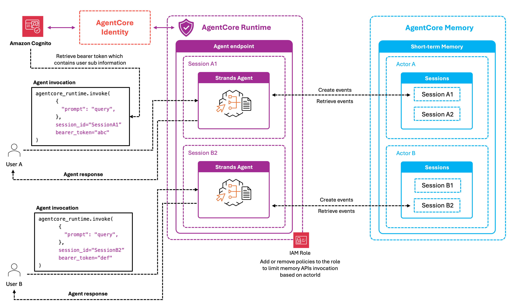

# Security

IAM, Cognito, and KMS patterns for production memory deployments.

| Folder | Covers |
|---|---|
| [`01-iam-scoped-access/`](./01-iam-scoped-access/) | Scoping access with IAM conditions on `namespace`, `namespacePath`, `actorId`, `sessionId` |
| [`02-cognito-federated-identity/`](./02-cognito-federated-identity/) | Federating end-user identities into IAM via Cognito for per-user memory isolation |
| [`03-kms-encryption/`](./03-kms-encryption/) | Customer-managed KMS keys on memory resources via `encryptionKeyArn` |

## IAM-scoped actor isolation



The agent deploys to AgentCore runtime behind a Cognito JWT authorizer. The runtime execution role carries an IAM inline policy with a `StringEquals` condition on `bedrock-agentcore:actorId` — set to the authenticated user's Cognito `sub`. Memory operations (read/write events, retrieve records) are permitted only for that actor. Swapping the allowed `actorId` in the policy immediately blocks access to a different user's memory.

## Cognito federated identity


The Cognito-federated variant extends IAM scoping by dynamically obtaining per-user temporary credentials via the Cognito Identity Pool + STS `AssumeRoleWithWebIdentity` flow. The user's Cognito JWT is exchanged for short-lived AWS credentials scoped to their `actorId`, so no long-lived service role credential touches the user's data.

## Best practices

- **Stack defenses.** IAM scoping by `actorId` + namespace conventions + per-tenant CMKs each cover a different failure mode.
- **Use namespaces for scoping records, not for access control.** A misconfigured IAM policy will let the wrong actor read your namespace; treat namespace as organisation, IAM as the boundary.
- **Prefer federated short-lived credentials** over long-lived service roles for any user-facing path.
- **One CMK per tenant** when contracts demand customer-controlled key revocation.
- **Audit `bedrock-agentcore:actorId` and `kms:Decrypt`** in CloudTrail. They're the two signals you want to keep.

## See also

- Namespaces for scoping records: [`../02-long-term-memory/04-namespaces/`](../02-long-term-memory/04-namespaces/)
- Memory observability metrics for streaming-related IAM/KMS errors: [`../04-observability/`](../04-observability/)

## Running

```bash
# 01-iam-scoped-access/
python 01-iam-scoped-access/runtime_memory_identity_integration.py

# 02-cognito-federated-identity/
python 02-cognito-federated-identity/runtime_memory_federated_identity_integration.py

# 03-kms-encryption/
python 03-kms-encryption/kms-encryption.py
```
