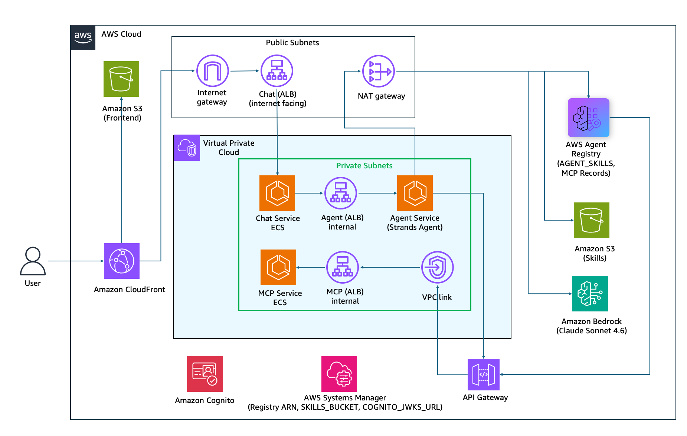
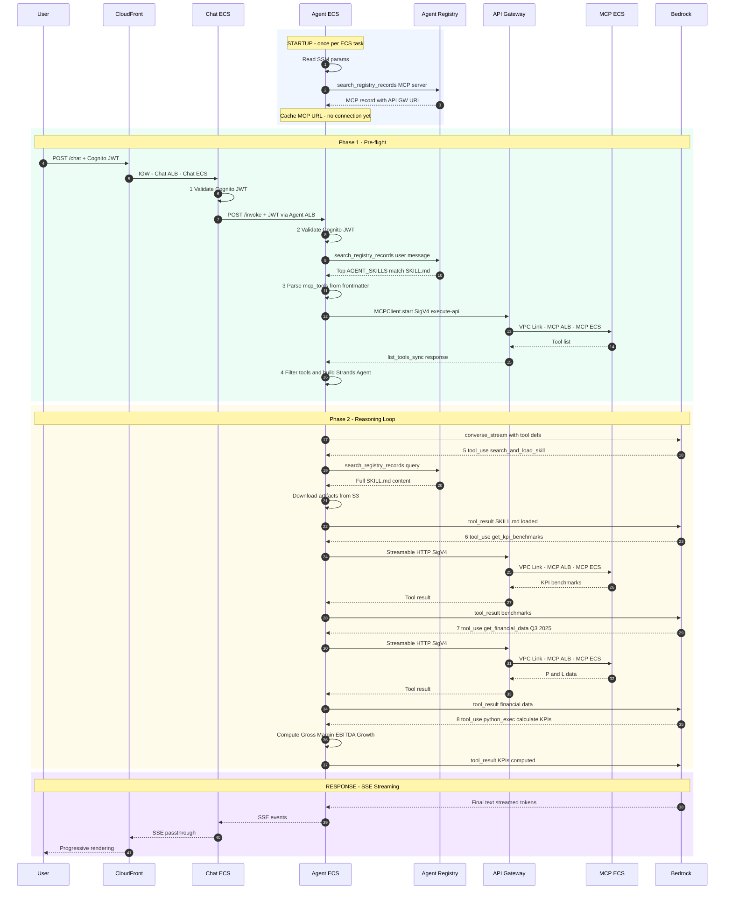

# Registry-Driven Agent with Strands, MCP, and ECS

## Overview

This sample demonstrates how to integrate **AWS Agent Registry** into an existing agentic architecture where the agent and MCP server are self-hosted on **Amazon ECS** — without requiring a full migration to AgentCore Runtime or AgentCore Gateway.

If you already host Strands agents and MCP servers on ECS or EKS and manage your own compute, networking, and container lifecycle, this sample shows how to adopt AWS Agent Registry as a **centralized discovery and governance layer** on top of that existing infrastructure — gaining semantic search, skill versioning, and approval workflows without changing how your agents and tools are deployed.

This sample is useful in two ways:
- **If you are already on ECS/EKS**: a practical starting point for adding registry-driven skill discovery to a self-hosted agentic system.
- **If you are evaluating AgentCore**: a reference for the registry integration pattern before adopting AgentCore Runtime or Gateway for compute.

Financial analysis is used as the example domain to keep the sample concrete and runnable, but the registry-driven architecture pattern applies broadly — customer support, legal document review, code analysis, and any domain where an agent's capabilities evolve independently of its infrastructure.

| Information | Details |
|-------------|---------|
| Use case type | Conversational AI |
| Agent type | Single agent with dynamic skill discovery |
| Use case components | Agent Registry, Strands Agent, MCP Server, Chat Interface |
| Use case vertical | Financial Analysis |
| Example complexity | Advanced |
| SDK used | Strands Agents SDK, Amazon Bedrock AgentCore SDK, boto3 |

## Architecture



### Components

| Component | Technology | Role |
|-----------|-----------|------|
| Agent Registry | AWS Agent Registry | Stores skills and MCP server schemas; serves semantic search |
| Strands Agent | Python / Strands SDK | Per-request: search registry → read skill → load tools → invoke the model |
| MCP Server | FastMCP / Python | Exposes `get_financial_data` and `get_kpi_benchmarks` tools |
| Chat Interface | FastAPI + SSE | Browser-facing proxy; streams agent step events to the UI |
| Frontend | Amazon S3 + CloudFront | Serves the React chat UI as a static site |
| Infrastructure | ECS Fargate, API GW, VPC, CloudFormation | Private VPC; API Gateway bridges internal MCP server to the registry crawler |

### Two-Phase Request Flow

Each user request goes through two phases before a response is returned.

**Phase 1 — Pre-flight (before the model is invoked)**

Rather than loading all available tools upfront, the agent first figures out exactly what it needs for this specific request. This keeps context lean and tool selection precise.

1. **Registry search** — the raw user message is used as the search query. The registry returns records ranked by vector similarity. The agent filters to `AGENT_SKILLS` records.
2. **Parse frontmatter** — the top-ranked record's `SKILL.md` is parsed to read the `mcp_tools:` list declaring which MCP tools that skill needs.
3. **Selective MCP tool loading** — connects to the MCP server and loads *only* the declared tools, not the entire server.
4. **Build the Strands agent** — constructs the agent instance with base tools + the skill's specific MCP tools.

**Phase 2 — Strands reasoning loop (the LLM drives this)**

With the right tools loaded, the LLM follows the skill's step-by-step procedure to complete the task.

5. **Load full SKILL.md** — the LLM calls `search_and_load_skill` to load the complete skill procedure including instructions, formulas, and context.
6. **Follow the procedure** — the LLM calls the MCP tools as instructed by the skill steps, interpreting results and deciding next actions.
7. **Return answer** — the final answer is streamed back to the UI via Server-Sent Events (SSE), so the user sees progress in real time.

## Request Flow



## What's in the Registry

`setup.py` and `register_skills.py` populate the registry with two types of records. Together they give the agent everything it needs to discover capabilities and connect to the right tools at runtime — no skills or tool URLs are hardcoded anywhere in the agent code.

### MCP Record — `financial-tools-mcp`

One MCP record pointing to the MCP server. When you run `setup.py`, the registry crawler assumes the agent's IAM role, calls the API Gateway endpoint, and automatically extracts and stores the tool schemas. The agent reads the server URL from this record at startup — it never needs SSM or a config file for the MCP endpoint.

| Tool | Description |
|------|-------------|
| `get_financial_data` | Returns quarterly P&L data (revenue, COGS, operating expenses, EBITDA) for a given period |
| `get_kpi_benchmarks` | Returns industry benchmark thresholds and KPI formulas (Gross Margin, EBITDA Margin, OpEx Ratio, Revenue Growth) |

### AGENT_SKILLS Records — Five Skills

Each skill is a `SKILL.md` file stored as inline content in the registry. The YAML frontmatter declares which MCP tools that skill needs — the agent uses this to load only the relevant tools for each request, keeping the LLM context focused.

| Skill | Description | MCP tools declared |
|-------|-------------|-------------------|
| `quarterly-kpi-calculator` | Calculates Gross Margin %, EBITDA Margin %, OpEx Ratio, and QoQ Revenue Growth from P&L data | `get_financial_data`, `get_kpi_benchmarks` |
| `cost-efficiency-analyzer` | Analyzes cost structure and operating expense efficiency | `get_financial_data`, `get_kpi_benchmarks` |
| `revenue-growth-analyst` | Deep-dives into top-line revenue growth across quarters | `get_financial_data` |
| `multi-quarter-trend-analysis` | Produces a 4-quarter narrative trend analysis | `get_financial_data`, `get_kpi_benchmarks` |
| `executive-financial-briefing` | One-page CFO/board-level financial briefing | `get_financial_data`, `get_kpi_benchmarks` |

## Core Idea

> **Separate what an agent knows how to do from the agent itself.**

The key insight in this architecture is that skills — the step-by-step procedures an agent follows, the tools it needs, and the context it requires — are stored externally in the registry rather than hardcoded into the agent. This means you can add a new skill, update an existing one, or retire an outdated procedure without touching the agent code or triggering a redeployment. The agent simply discovers what's available at runtime and follows whatever the registry tells it to do.

```
User prompt
  → Registry search (find the right skill)
    → Parse SKILL.md frontmatter (which MCP tools are needed)
      → Load only those tools from the MCP server
        → LLM reasoning loop (follow the skill procedure)
          → Final answer
```

## Key Features

- **Zero hardcoded skills** — the agent discovers all capabilities at runtime from the registry; adding a new skill requires no code changes
- **Selective tool loading** — only the MCP tools declared in a skill's frontmatter are loaded per request, keeping LLM context lean
- **Auto-approval workflow** — registry records transition from DRAFT → PENDING_APPROVAL → APPROVED in a single script
- **SigV4 MCP transport** — the MCP server is protected behind API Gateway with IAM auth; the agent signs every request with SigV4
- **SSE streaming** — agent reasoning steps and the final answer stream to the chat UI in real time via Server-Sent Events

## Prerequisites

### Required Software

- **Python 3.11+**
- **Docker** (for building and pushing container images)
- **AWS CLI v2** (configured with appropriate credentials)

### AWS Account Requirements

- **AWS Region**: `us-east-1` (AgentCore public preview availability)
- **Amazon Bedrock AgentCore** enabled in your account
- **Model access**: `us.anthropic.claude-sonnet-4-6` (cross-region inference profile) enabled in Amazon Bedrock
- **Three ECR repositories** pre-created for the agent, chat, and MCP server images. Create them before building Docker images:

```bash
aws ecr create-repository --repository-name financial-agent-mcp --region us-east-1
aws ecr create-repository --repository-name financial-agent-agent --region us-east-1
aws ecr create-repository --repository-name financial-agent-chat --region us-east-1
```

### Python Dependencies

The infrastructure scripts (`setup.py` and `register_skills.py`) run locally and need boto3 and the AgentCore SDK. Install them before running the registry setup steps:

```bash
pip install boto3>=1.42.87 bedrock-agentcore
```

The per-service `requirements.txt` files (`deploy/agent/`, `deploy/chat/`, `deploy/mcp/`) are only used inside the Docker containers — you do not need to install them locally.

### IAM Permissions

Your AWS user/role needs the following permissions to deploy the stack and run the setup scripts:

```json
{
  "Version": "2012-10-17",
  "Statement": [
    {
      "Effect": "Allow",
      "Action": [
        "cloudformation:*",
        "ecs:*",
        "ecr:*",
        "ec2:*",
        "elasticloadbalancing:*",
        "apigateway:*",
        "s3:*",
        "ssm:*",
        "cognito-idp:*",
        "iam:*",
        "logs:*",
        "cloudfront:*",
        "bedrock-agentcore:*"
      ],
      "Resource": "*"
    }
  ]
}
```

## Deployment Steps

### 1. Build and Push Docker Images

Each of the three services has its own Dockerfile. Build and push them to ECR before deploying the CloudFormation stack.

```bash
AWS_ACCOUNT=<your-account-id>
REGION=us-east-1

# Authenticate with ECR
aws ecr get-login-password --region $REGION | docker login --username AWS --password-stdin $AWS_ACCOUNT.dkr.ecr.$REGION.amazonaws.com

# MCP server
docker build -t $AWS_ACCOUNT.dkr.ecr.$REGION.amazonaws.com/financial-agent-mcp:latest deploy/mcp/
docker push $AWS_ACCOUNT.dkr.ecr.$REGION.amazonaws.com/financial-agent-mcp:latest

# Strands agent
docker build -t $AWS_ACCOUNT.dkr.ecr.$REGION.amazonaws.com/financial-agent-agent:latest deploy/agent/
docker push $AWS_ACCOUNT.dkr.ecr.$REGION.amazonaws.com/financial-agent-agent:latest

# Chat interface
docker build -t $AWS_ACCOUNT.dkr.ecr.$REGION.amazonaws.com/financial-agent-chat:latest deploy/chat/
docker push $AWS_ACCOUNT.dkr.ecr.$REGION.amazonaws.com/financial-agent-chat:latest
```

### 2. Deploy the CloudFormation Stack

The stack provisions all infrastructure — VPC with public and private subnets across two Availability Zones, NAT Gateway, ECS Fargate cluster, three ECS services (MCP/Agent/Chat), internal ALBs, API Gateway with VPC Link, S3 buckets (skills artifacts and frontend), CloudFront distribution, Cognito User Pool, IAM roles, and CloudWatch log groups.

```bash
aws cloudformation deploy \
  --template-file deploy/infra/cfn.yaml \
  --stack-name financial-agent \
  --capabilities CAPABILITY_NAMED_IAM \
  --parameter-overrides \
    McpImageUri=$AWS_ACCOUNT.dkr.ecr.$REGION.amazonaws.com/financial-agent-mcp:latest \
    AgentImageUri=$AWS_ACCOUNT.dkr.ecr.$REGION.amazonaws.com/financial-agent-agent:latest \
    ChatImageUri=$AWS_ACCOUNT.dkr.ecr.$REGION.amazonaws.com/financial-agent-chat:latest
```

Deployment typically takes 5–10 minutes. Once complete, retrieve the stack outputs — you will need them in the steps below:

```bash
aws cloudformation describe-stacks \
  --stack-name financial-agent \
  --query "Stacks[0].Outputs" \
  --output table
```

### 3. Upload the Frontend

The chat UI (`deploy/chat/static/index.html`) is served from S3 via CloudFront. Update the Cognito configuration in the file with the values from the stack outputs, then upload it:

```bash
# Edit deploy/chat/static/index.html and replace:
#   <YOUR_COGNITO_POOL_ID>    → CognitoUserPoolId output value
#   <YOUR_COGNITO_APP_CLIENT_ID> → CognitoUserPoolClientId output value

aws s3 cp deploy/chat/static/index.html s3://<FrontendBucketName>/index.html
```

### 4. Start the MCP Service

The MCP service must be running before registry setup, because the registry crawler will connect to it live during record creation to extract tool schemas.

```bash
aws ecs update-service \
  --cluster financial-agent-cluster \
  --service financial-agent-mcp \
  --desired-count 1
```

Wait for the service to reach a steady state (roughly 60–90 seconds) before proceeding.

### 5. Run One-Time Registry Setup

This script creates the registry, publishes and approves the MCP record (the crawler will fetch the live MCP server), publishes and approves the `quarterly-kpi-calculator` skill, and writes the registry ARN and skills bucket name to SSM Parameter Store.

```bash
python deploy/infra/setup.py \
  --region us-east-1 \
  --bucket <SkillsBucketName from outputs> \
  --apigw-url <McpApiGwUrl from outputs>
```

> **Why a Python script and not CloudFormation?**
> The AWS Agent Registry (`bedrock-agentcore-control`) does not have CloudFormation resource types yet. `setup.py` handles all registry operations via direct boto3 API calls. Once CloudFormation support is added, this step can be folded into the stack.

### 6. Register Additional Skills

The four remaining skills (`cost-efficiency-analyzer`, `revenue-growth-analyst`, `multi-quarter-trend-analysis`, `executive-financial-briefing`) are registered separately. This script checks for existing records and skips any that are already registered, so it is safe to re-run.

```bash
python deploy/infra/register_skills.py \
  --registry-arn <REGISTRY_ARN from setup output> \
  --region us-east-1
```

### 7. Start Agent and Chat Services

With the registry populated, start the remaining two services. The agent reads the MCP server URL from the registry at startup, so the registry must be ready before the agent task launches.

```bash
aws ecs update-service --cluster financial-agent-cluster --service financial-agent-agent --desired-count 1
aws ecs update-service --cluster financial-agent-cluster --service financial-agent-chat --desired-count 1
```

Once both services are healthy, open the `CloudFrontDomain` URL from the stack outputs in your browser. You will see a login page. Create a Cognito user with the following command, then sign in with those credentials:

```bash
aws cognito-idp admin-create-user \
  --user-pool-id <CognitoUserPoolId from outputs> \
  --username your@email.com \
  --message-action SUPPRESS \
  --temporary-password TempPass123!

# Then set a permanent password (required on first login):
aws cognito-idp admin-set-user-password \
  --user-pool-id <CognitoUserPoolId from outputs> \
  --username your@email.com \
  --password YourPermanentPassword123! \
  --permanent
```

## Sample Queries

The agent uses semantic search to match your natural language query to the most relevant skill. Try these to exercise different skills:

```
"Calculate the quarterly KPIs for Q3 2025"
"Show me gross margin and EBITDA for last quarter"
"Are we spending too much on operating expenses?"
"Show me the revenue growth trend over the last 4 quarters"
"Give me an executive briefing on how the business is doing"
"Compare Q2 and Q3 2025 revenue growth"
```

## Troubleshooting

### Common Issues

**"Unable to assume the provided IAM role" during registry setup**

The AgentCore registry crawler calls `sts:AssumeRole` on the role specified in `credentialProviderConfigurations`. The role's trust policy must explicitly allow `bedrock-agentcore.amazonaws.com` as a service principal — without this, the crawler cannot authenticate to fetch the MCP server manifest.

```yaml
# In the agent task role's AssumeRolePolicyDocument:
- Effect: Allow
  Principal:
    Service: bedrock-agentcore.amazonaws.com
  Action: sts:AssumeRole
```

**Registry crawler fails to parse MCP server response**

FastMCP defaults to SSE (Server-Sent Events) responses. The registry crawler sends a one-shot HTTP POST and expects a plain JSON response back. Enable JSON responses in the MCP server:

```python
mcp_app = mcp.http_app(json_response=True)  # required for registry URL-sync crawling
```

**Agent cannot find MCP server URL after startup**

`search_registry_records` does not return `synchronizationConfiguration`. The MCP server URL is stored by the crawler inside `descriptors.mcp.server.inlineContent` as a JSON string — parse it like this:

```python
inline = record["descriptors"]["mcp"]["server"]["inlineContent"]
server_json = json.loads(inline)
url = server_json["remotes"][0]["url"]
```

**RuntimeError on every MCP request**

FastMCP's lifespan must be passed to Starlette explicitly. Without it, the session manager is never initialized and every request fails:

```python
app = Starlette(
    routes=[...],
    lifespan=mcp_app.lifespan,  # required — omitting causes RuntimeError on every request
)
```

### Debug Commands

```bash
# Check ECS service status
aws ecs describe-services --cluster financial-agent-cluster \
  --services financial-agent-mcp financial-agent-agent financial-agent-chat

# Tail agent logs live
aws logs tail /ecs/financial-agent/agent --follow

# Tail chat logs live
aws logs tail /ecs/financial-agent/chat --follow

# List registry records
aws bedrock-agentcore-control list-registry-records \
  --registry-id <REGISTRY_ID> --region us-east-1

# Search registry
aws bedrock-agentcore search-registry-records \
  --search-query "financial KPIs" \
  --registry-ids "<REGISTRY_ARN>" \
  --region us-east-1
```

## Cleanup Instructions

Clean up in the order below to avoid dependency errors. Registry records must be deleted before the registry itself, and the S3 buckets must be emptied before CloudFormation can delete them.

### 1. Delete Registry Records and Registry

```bash
# List all records
aws bedrock-agentcore-control list-registry-records \
  --registry-id <REGISTRY_ID> --region us-east-1

# Delete each record
aws bedrock-agentcore-control delete-registry-record \
  --registry-id <REGISTRY_ID> --record-id <RECORD_ID> --region us-east-1

# Then delete the registry itself
aws bedrock-agentcore-control delete-registry \
  --registry-id <REGISTRY_ID> --region us-east-1
```

### 2. Scale Down ECS Services

```bash
aws ecs update-service --cluster financial-agent-cluster --service financial-agent-mcp --desired-count 0
aws ecs update-service --cluster financial-agent-cluster --service financial-agent-agent --desired-count 0
aws ecs update-service --cluster financial-agent-cluster --service financial-agent-chat --desired-count 0
```

### 3. Empty S3 Buckets

CloudFormation cannot delete non-empty S3 buckets. Empty both buckets before deleting the stack:

```bash
aws s3 rm s3://<SkillsBucketName> --recursive
aws s3 rm s3://<FrontendBucketName> --recursive
```

### 4. Delete the CloudFormation Stack

```bash
aws cloudformation delete-stack --stack-name financial-agent
```

Stack deletion takes 5–10 minutes. The CloudFront distribution takes the longest to deprovision.

## Project Structure

```
strands-mcp-ecs-registry/
├── deploy/
│   ├── agent/                          # Strands agent service
│   │   ├── agent.py                    # FastAPI app + registry search + MCP logic
│   │   ├── streamable_http_sigv4.py    # SigV4-signed MCP transport
│   │   ├── Dockerfile
│   │   └── requirements.txt
│   ├── chat/                           # Chat interface service
│   │   ├── chat.py                     # FastAPI SSE proxy + JWT validation
│   │   ├── static/index.html           # React chat UI (served via S3 + CloudFront)
│   │   ├── Dockerfile
│   │   └── requirements.txt
│   ├── mcp/                            # MCP server service
│   │   ├── mcp_server.py               # FastMCP server exposing financial tools
│   │   ├── Dockerfile
│   │   └── requirements.txt
│   └── infra/
│       ├── cfn.yaml                    # CloudFormation stack (~950 lines)
│       ├── setup.py                    # One-time registry + S3 setup script
│       └── register_skills.py          # Registers additional AGENT_SKILLS records
└── my_skills/
    ├── quarterly-kpi-calculator/       # Gross Margin, EBITDA, OpEx, QoQ Growth
    ├── cost-efficiency-analyzer/       # Cost structure and expense efficiency
    ├── revenue-growth-analyst/         # Top-line revenue growth deep-dive
    ├── multi-quarter-trend-analysis/   # 4-quarter trend narrative
    └── executive-financial-briefing/   # One-page CFO/board briefing
```

## Additional Resources

- [Amazon Bedrock AgentCore Documentation](https://docs.aws.amazon.com/bedrock-agentcore/)
- [AWS Agent Registry Developer Guide](https://docs.aws.amazon.com/bedrock-agentcore/latest/devguide/registry.html)
- [Strands Agents SDK](https://github.com/strands-agents/sdk-python)
- [Model Context Protocol (MCP)](https://modelcontextprotocol.io/)
- [FastMCP](https://github.com/jlowin/fastmcp)

## Disclaimer

The examples provided in this repository are for experimental and educational purposes only. They demonstrate concepts and techniques but are not intended for direct use in production environments without further review and hardening. Make sure to have Amazon Bedrock Guardrails in place to protect against prompt injection.
