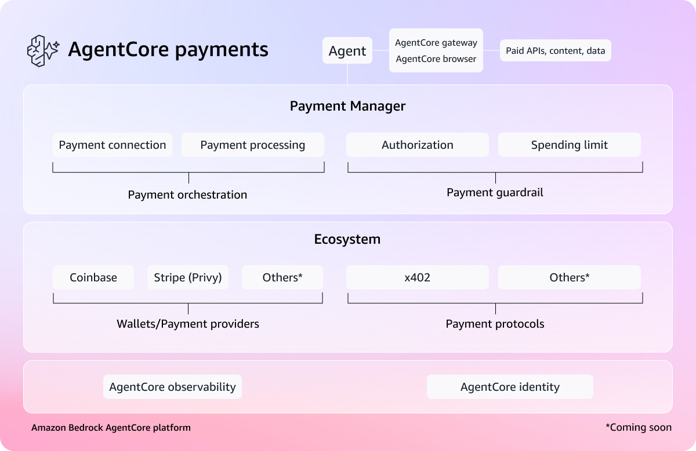

# Amazon Bedrock AgentCore payments — Samples

Amazon Bedrock AgentCore payments is a fully managed service that enables microtransaction payments in AI agents to access paid APIs, MCP servers, and content. AI agents increasingly handle complex tasks by calling APIs, accessing MCP servers, and interacting with other agents. As more services monetize through pay-per-use models, developers face challenges integrating payments into agentic workflows. Transactions are typically microtransactions (often under $1 or fractions of a cent), making traditional payment methods cost-prohibitive due to high minimum transaction fees. Meanwhile, content providers and publishers are introducing paywalls for AI agents to access their content. AgentCore payments provides a suite of developer-friendly capabilities that help you develop solutions to enable secure, instant payments to paid services using stablecoin, open protocols like x402 for cost-effective microtransactions, and configurable guardrails to help control agent spending. This can reduce developer effort from months to days.

> **Preview** — AgentCore payments is currently available as a preview. Features and APIs may change before general availability.

## Tutorials

Step-by-step notebooks covering setup through advanced multi-agent orchestration.

| # | Tutorial | What You'll Learn |
|---|----------|-------------------|
| 00 | [Setup](00-getting-started/00-setup-agentcore-payments/) | Create IAM roles, PaymentManager, PaymentConnector, embedded wallet, and a budgeted PaymentSession |
| 01 | [Payment limits on an agent](00-getting-started/01-agents-payments-and-limits/) | Strands and LangGraph agents that pay x402 endpoints automatically with budget enforcement |
| 02 | [Deploy to AgentCore Runtime](00-getting-started/02-deploy-to-agentcore-runtime/) | Package and deploy a payment agent with role separation and observability |
| 03 | [Wallet operations](00-getting-started/03-user-onboarding-wallet-funding/) | User onboarding, wallet funding, delegation, balance checks, multi-network instruments |
| 04 | [Gateway + Coinbase Bazaar](00-getting-started/04-agent-with-coinbase-bazaar-via-gateway/) | Discover 10,000+ paid MCP tools via AgentCore Gateway and pay on call |
| 05 | [Browser + payments](00-getting-started/05-agent-with-browser-tool-pay-for-content/) | Intercept 402 paywalls in a browser session and pay for web content |
| 06 | [Multi-agent orchestrator](00-getting-started/06-multi-agent-payment-orchestrator/) | Multiple agents with separate wallets, per-agent budgets, and runtime deploy |

## Use Cases

Real-world use case samples — coming soon. See [02-use-cases/](02-use-cases/).

## Prerequisites

- Python 3.10+
- AWS CLI configured (`aws sts get-caller-identity` to verify)
- AWS account with access to AgentCore payments preview
- Jupyter (`pip install jupyter`)
- Wallet provider credentials (Coinbase CDP or Stripe/Privy) — see Tutorial 00

## Security

- All tutorials use **testnet only** (Base Sepolia / Solana Devnet). No real funds are involved.
- Never commit `.env` files or private keys. Use AWS Secrets Manager for production credentials.
- Follow IAM least-privilege: separate ControlPlaneRole, ManagementRole, and ProcessPaymentRole.

## Resources

- [AgentCore payments documentation](https://docs.aws.amazon.com/bedrock-agentcore/latest/devguide/payments.html)
- [Launch blog post](https://aws.amazon.com/blogs/machine-learning/agents-that-transact-introducing-amazon-bedrock-agentcore-payments-built-with-coinbase-and-stripe/)
- [Coinbase announcement](https://www.coinbase.com/en-ca/blog/introducing-amazon-bedrock-agentcore-payments-powered-by-x402-and-coinbase)
- [Stripe announcement](https://stripe.com/newsroom/news/aws-stripe-agentcore-privy)

