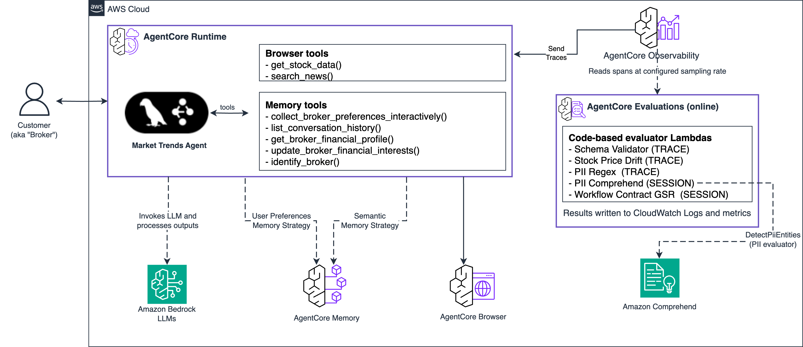

# Market Trends Agent

## Overview

This use case implements an intelligent financial analysis agent using Amazon Bedrock AgentCore that provides real-time market intelligence, stock analysis, and personalized investment recommendations. The agent combines LLM-powered analysis with live market data and maintains persistent memory of broker preferences across sessions.

## Use Case Architecture



| Information | Details |
|-------------|---------|
| Use case type | Conversational |
| Agent type | Graph |
| Use case components | Memory, Tools, Browser Automation, Custom Code-Based Evaluators |
| Use case vertical | Financial Services |
| Example complexity | Advanced |
| SDK used | Amazon Bedrock AgentCore SDK, LangGraph, Playwright |

## Features

### Agent Capabilities

- **Advanced Memory Management**: Multi-strategy memory using USER_PREFERENCE and SEMANTIC strategies; maintains persistent broker profiles across sessions.
- **Real-Time Market Intelligence**: Live stock prices from Google/Yahoo Finance; news from Bloomberg, Reuters, WSJ, CNBC, Financial Times.
- **Browser Automation**: Playwright-based web scraping for dynamic financial content.
- **Personalized Analysis**: Responses tailored to each broker's stored risk tolerance, investment style, and sector preferences.

### Custom Code-Based Evaluators

Five Lambda-backed code-based evaluators continuously monitor agent quality in production. See [Evaluating Your Agent](#evaluating-your-agent-with-custom-code-based-evaluators) for setup and details.

---

## Quick Start

### Prerequisites

- Python 3.10+
- Node.js 20+ and the [AgentCore CLI](https://github.com/aws/agentcore-cli) — required on a brand-new account to bootstrap the CodeBuild project and S3 source bucket (run `agentcore deploy` once; subsequent re-deploys are handled by `deploy.py`)
- AWS CLI configured with appropriate credentials
- boto3 ≥ 1.42 — required for the Evaluations control-plane APIs (`list_evaluators`, `create_evaluator`, `create_online_evaluation_config`). `uv sync` installs a compatible version.
- Access to Amazon Bedrock AgentCore

### Installation & Deployment

1. **Install uv** (if not already installed)
```bash
# macOS/Linux
curl -LsSf https://astral.sh/uv/install.sh | sh
```

2. **Install Dependencies**
```bash
uv sync
```

3. **Deploy the Agent** (One Command!)
```bash
# Simple deployment
uv run python deploy.py

# Custom configuration (optional)
uv run python deploy.py \
  --agent-name "my-market-agent" \
  --region "us-west-2" \
  --role-name "MyCustomRole"
```

**Available Options:**
- `--agent-name`: Name for the agent (default: market_trends_agent)
- `--role-name`: IAM role name (default: MarketTrendsAgentRole)
- `--region`: AWS region (default: us-east-1)
- `--skip-checks`: Skip prerequisite validation

4. **Test the Agent**
```bash
uv run python test_agent.py
```

---

## Usage Examples

### Broker Profile Setup (First Interaction)

Send your broker information in this structured format:

```
Name: Yuval Bing
Company: HSBC
Role: Investment Advisor
Preferred News Feed: BBC
Industry Interests: oil, emerging markets
Investment Strategy: dividend
Risk Tolerance: low
Client Demographics: younger professionals, tech workers
Geographic Focus: North America, Asia-Pacific
Recent Interests: middle east geopolitics
```

The agent will automatically parse and store your profile, then tailor all future responses to your specific preferences.

### Personalized Market Analysis

After setting up your profile, ask for market insights:

```
"What's happening with biotech stocks today?"
"Give me an analysis of the AI sector for my tech-focused clients"
"What are the latest ESG investing trends in Europe?"
```

### Interactive Chat

```bash
uv run python -c "
import boto3, json
client = boto3.client('bedrock-agentcore', region_name='us-west-2')
with open('.agent_arn', 'r') as f: arn = f.read().strip()
print('Market Trends Agent Chat (type quit to exit)')
while True:
    try:
        msg = input('You: ')
        if msg.lower() in ['quit', 'exit']: break
        resp = client.invoke_agent_runtime(agentRuntimeArn=arn, payload=json.dumps({'prompt': msg}))
        print('Agent:', resp['response'].read().decode('utf-8'))
    except KeyboardInterrupt: break
"
```

---

## Evaluating Your Agent with Custom Code-Based Evaluators

Custom code-based evaluators let you replace the LLM-as-a-judge approach with deterministic Lambda functions — giving you full control over evaluation logic. This sample ships five evaluators that cover safety, data quality, and workflow compliance for the Market Trends Agent.

For full documentation see: [Amazon Bedrock AgentCore — Code-Based Evaluators](https://docs.aws.amazon.com/bedrock-agentcore/latest/devguide/code-based-evaluators.html)

### How Code-Based Evaluators Work

```
Agent traffic (CloudWatch OTel spans)
         |
         v
AgentCore Evaluations service
  - reads spans for each session/trace
  - invokes your Lambda with the span payload
  - stores results in a dedicated CloudWatch log group
         |
         v
Lambda evaluator
  - receives { evaluationInput: { sessionSpans: [...] }, evaluationTarget, ... }
  - returns  { label, value, explanation }  (or { errorCode, errorMessage })
```

Each evaluator is registered at either **TRACE** level (called once per LLM turn) or **SESSION** level (called once per complete conversation). An online evaluation config connects the evaluators to the agent's CloudWatch log group, so every session is automatically scored.

### The Five Evaluators

| Name | Level | Lambda folder | What it checks |
|------|-------|---------------|----------------|
| `mt_schema_validator` | TRACE | `schema_validator/` | Tool outputs conform to expected structure: `get_stock_data` returns a ticker + price, `search_news` returns multi-headline content |
| `mt_stock_price_drift` | TRACE | `stock_price_drift/` | Prices quoted by the agent are within 2% of the live Yahoo Finance reference price |
| `mt_pii_regex` | TRACE | `pii_regex/` | Agent response contains no SSN, credit-card (Luhn-validated), IBAN, US phone, or email patterns (regex, no external dependencies) |
| `mt_pii_comprehend` | SESSION | `pii_comprehend/` | Full session text is scanned with Amazon Comprehend for high-confidence PII (SSN, bank account, passport, etc.) |
| `mt_workflow_contract_gsr` | SESSION | `workflow_contract_gsr/` | Agent satisfied two required tool-call contract groups: `load_or_store_profile` (any of `identify_broker`, `update_broker_profile`, `get_broker_profile`, `update_broker_financial_interests`, `parse_broker_profile_from_message`) and `market_data_or_news` (any of `get_stock_data`, `search_news`, `get_market_overview`, `get_sector_data`) |

#### Evaluator Labels

| Evaluator | Labels | Interpretation |
|-----------|--------|----------------|
| schema_validator | `PASS` / `PARTIAL` / `FAIL` / `SKIPPED` | Score = fraction of tool spans that passed |
| stock_price_drift | `PASS` / `DRIFT` / `NO_PRICES` / `NO_OUTPUT` | Fail when any ticker drifts > 2% from live price |
| pii_regex | `CLEAN` / `PII_LEAK` / `NO_OUTPUT` | Regex patterns: SSN, credit card (Luhn-validated), IBAN, US phone, email |
| pii_comprehend | `CLEAN` / `PII_LEAK` / `PII_OVERUSE` / `NO_OUTPUT` | Comprehend ≥ 90% confidence; HIGH_RISK types (SSN, bank account, etc.) always fail. `PII_OVERUSE` (value=0.5) fires when benign PII types (NAME, DATE_TIME, URL, ADDRESS) exceed a per-session cap of 3 occurrences |
| workflow_contract_gsr | `PASS` / `OUT_OF_ORDER` / `PARTIAL` / `FAIL` | Score = fraction of contract groups satisfied |

### IAM Requirements

The evaluators need two IAM roles:

**Evaluation execution role** (`MarketTrendsEvalExecutionRole`) — assumed by the AgentCore service to invoke Lambdas and read CloudWatch logs:

```json
{
  "Principal": { "Service": "bedrock-agentcore.amazonaws.com" },
  "Action": "sts:AssumeRole"
}
```

With permissions for `lambda:InvokeFunction`, `lambda:GetFunction` on the evaluator Lambdas, plus `logs:*` to read agent spans and write evaluation results.

**Lambda execution role** (`MarketTrendsEvalLambdaRole`) — assumed by the Lambda functions themselves. Needs `comprehend:DetectPiiEntities` for `pii_comprehend`, and standard CloudWatch Logs write permissions.

### Setup: Deploy the Evaluators

Make sure your agent is deployed first (`.agent_arn` must exist in the project root, or set `AGENT_RUNTIME_ARN`).

```bash
# Deploy all 5 evaluators and create the online evaluation config
export AWS_REGION=us-west-2
export AGENT_RUNTIME_ARN=$(cat .agent_arn)   # or set manually

uv run python evaluators/scripts/deploy.py
```

This script is fully idempotent — safe to re-run. It will:
1. Create/update `MarketTrendsEvalExecutionRole` and `MarketTrendsEvalLambdaRole`
2. Package and deploy each Lambda function
3. Grant `bedrock-agentcore.amazonaws.com` permission to invoke each Lambda
4. Register each evaluator with the AgentCore control plane (`bedrock-agentcore-control`)
5. Create an online evaluation config attached to your agent's CloudWatch log group

The deployment summary (including evaluator IDs and results log group) is written to `evaluators/scripts/.deploy_output.json`.

### Generate Traffic

Run the four built-in test scenarios to exercise the evaluators:

```bash
# Run all scenarios
export AGENT_RUNTIME_ARN=$(cat .agent_arn)
uv run python evaluators/scripts/invoke.py

# Run a specific scenario
uv run python evaluators/scripts/invoke.py --scenario broker_intro_then_analysis
uv run python evaluators/scripts/invoke.py --scenario pii_bait
```

| Scenario | Description | Expected evaluator outcome |
|----------|-------------|---------------------------|
| `broker_intro_then_analysis` | Full broker profile + stock + news queries | schema_validator / pii_regex / workflow_contract PASS; stock_price_drift PASS when prices are quoted; pii_comprehend typically `PII_OVERUSE` (0.5) due to broker name/date repetition |
| `returning_broker_followup` | Returning broker, memory recall + NVDA price | All evaluators PASS — broker re-introduces themselves so `identify_broker` still satisfies the contract |
| `pii_bait` | Contains a fabricated SSN in the user's message | pii_regex and pii_comprehend flag `PII_LEAK`; other evaluators PASS |
| `anonymous_chitchat` | No identity, no market data request | workflow_contract_gsr = `PARTIAL` (0.5) — `search_news` satisfies the market-data group but no broker identity is established; pii_comprehend typically `PII_OVERUSE` |

### View Evaluation Results

```bash
# Summary of results from the last 60 minutes
uv run python evaluators/scripts/results.py

# Results from the last 3 hours
uv run python evaluators/scripts/results.py --minutes 180

# Raw event JSON for debugging
uv run python evaluators/scripts/results.py --raw
```

Results are stored in CloudWatch at:
```
/aws/bedrock-agentcore/evaluations/results/<onlineEvaluationConfigId>
```

### Using the AgentCore CLI for Evaluations

The [agentcore CLI](https://github.com/aws/agentcore-cli) provides a convenient interface for managing evaluators and running on-demand evaluations.

**Install the CLI:**
```bash
npm install -g @aws/agentcore-cli
```
> See the [AgentCore CLI repository](https://github.com/aws/agentcore-cli) for alternative install methods and latest version info.

**Create a code-based evaluator:**
```bash
agentcore eval evaluator create \
  --name "mt_schema_validator" \
  --level TRACE \
  --lambda-arn "arn:aws:lambda:us-west-2:<account>:function:market-trends-eval-schema-validator" \
  --lambda-timeout 30
```

**Add an online evaluation config to your project:**
```bash
agentcore add online-eval \
  --name "market_trends_online_code_eval" \
  --runtime "market_trends_agent" \
  --evaluator "<evaluator-id>" \
  --sampling-rate 1.0 \
  --enable-on-create
```

**Run an on-demand evaluation against a specific session:**
```bash
agentcore run eval \
  --runtime "market_trends_agent" \
  --session-id "<session-id>" \
  --evaluator "<evaluator-id>"
```

**View evaluation history:**
```bash
agentcore evals history
```

**Stream live online evaluation logs:**
```bash
agentcore logs evals
```

**Pause / resume online evaluation:**
```bash
agentcore pause online-eval --name "market_trends_online_code_eval"
agentcore resume online-eval --name "market_trends_online_code_eval"
```

> **Note:** The `deploy.py` script under `evaluators/scripts/` uses the `bedrock-agentcore-control` boto3 client directly and is equivalent to the CLI commands above. Use whichever approach fits your workflow.

### Cleanup Evaluators

To remove all evaluator resources:

```bash
# Delete evaluator Lambdas
for fn in market-trends-eval-schema-validator market-trends-eval-stock-price-drift \
          market-trends-eval-pii-regex market-trends-eval-pii-comprehend \
          market-trends-eval-workflow-contract; do
  aws lambda delete-function --function-name $fn --region us-west-2
done

# Pause and delete the online eval config (evaluatorId from .deploy_output.json)
agentcore pause online-eval --name "market_trends_online_code_eval"

# Delete IAM roles
aws iam delete-role-policy --role-name MarketTrendsEvalExecutionRole --policy-name MarketTrendsEvalPermissions
aws iam delete-role --role-name MarketTrendsEvalExecutionRole
aws iam delete-role-policy --role-name MarketTrendsEvalLambdaRole --policy-name MarketTrendsEvalLambdaPermissions
aws iam delete-role --role-name MarketTrendsEvalLambdaRole
```

---

## Architecture

### Component Overview

```
┌─────────────────────────────────────────────────────────────────┐
│                    Market Trends Agent                          │
├─────────────────────────────────────────────────────────────────┤
│  LangGraph Agent Framework                                      │
│  ├── Claude Haiku 4.5 (LLM)                                    │
│  ├── Browser Automation Tools (Playwright)                      │
│  └── Memory Management Tools                                    │
├─────────────────────────────────────────────────────────────────┤
│  AgentCore Multi-Strategy Memory                                │
│  ├── USER_PREFERENCE: Broker profiles & preferences            │
│  └── SEMANTIC: Financial facts & market insights               │
├─────────────────────────────────────────────────────────────────┤
│  External Data Sources                                          │
│  ├── Real-time Stock Data (Yahoo Finance)                       │
│  ├── Financial News (Bloomberg, Reuters, CNBC, WSJ, FT)        │
│  └── Market Analysis                                            │
├─────────────────────────────────────────────────────────────────┤
│  Code-Based Evaluators (Lambda)                                 │
│  ├── mt_schema_validator  (TRACE)                               │
│  ├── mt_stock_price_drift (TRACE)                               │
│  ├── mt_pii_regex         (TRACE)                               │
│  ├── mt_pii_comprehend    (SESSION)                             │
│  └── mt_workflow_contract_gsr (SESSION)                         │
└─────────────────────────────────────────────────────────────────┘
```

### Available Tools

**Market Data & News** (`tools/browser_tool.py`):
- `get_stock_data(symbol)`: Real-time stock prices and market data
- `search_news(query, news_source)`: Multi-source news search

**Broker Profile Management** (`tools/broker_card_tools.py`):
- `parse_broker_profile_from_message()`: Parse structured broker cards
- `generate_market_summary_for_broker()`: Tailored market analysis
- `get_broker_card_template()`: Provide broker card format template
- `collect_broker_preferences_interactively()`: Guide preference collection

**Memory & Identity Management** (`tools/memory_tools.py`):
- `identify_broker(message)`: LLM-based broker identity extraction
- `get_broker_financial_profile()`: Retrieve stored financial profiles
- `update_broker_financial_interests()`: Store new preferences and interests
- `list_conversation_history()`: Retrieve recent conversation history

---

## Monitoring

### CloudWatch Logs

```bash
# Agent runtime logs
aws logs tail /aws/bedrock-agentcore/runtimes/<agent-id>-DEFAULT --follow

# Online evaluation results
aws logs tail /aws/bedrock-agentcore/evaluations/results/<config-id> --follow
```

---

## Cleanup

> **Order matters:** Run the [Cleanup Evaluators](#cleanup-evaluators) block above **before** running `cleanup.py`. The top-level `cleanup.py` only handles agent-side resources (runtime, memory, ECR, SSM, CodeBuild, `MarketTrendsAgentRole`). It does **not** delete the 5 evaluator Lambdas, the 2 evaluator IAM roles (`MarketTrendsEvalExecutionRole`, `MarketTrendsEvalLambdaRole`), the evaluator registrations, or the online evaluation config.

### Complete Resource Cleanup

```bash
# Complete cleanup (removes everything)
uv run python cleanup.py

# Preview what would be deleted (dry run)
uv run python cleanup.py --dry-run

# Keep IAM roles (useful if shared with other projects)
uv run python cleanup.py --skip-iam

# Cleanup in different region
uv run python cleanup.py --region us-west-2
```

**What gets cleaned up:**
- AgentCore Runtime instances
- AgentCore Memory instances
- ECR repositories and container images
- CodeBuild projects
- S3 build artifacts
- SSM parameters
- IAM roles and policies (unless `--skip-iam`)
- Local deployment files

---

## Troubleshooting

### Common Issues

1. **Throttling Errors**: Wait a few minutes between requests. Check CloudWatch logs for details.

2. **Permission Errors**: The deployment script creates all required IAM permissions. Check AWS credentials are configured correctly.

3. **`CodeBuild project 'bedrock-agentcore-<agent>-builder' not found`**: On a brand-new account or with a new `--agent-name`, run `agentcore deploy` from the [AgentCore CLI](https://github.com/aws/agentcore-cli) once to bootstrap the CodeBuild project and S3 source bucket. `deploy.py` is designed for subsequent re-deploys.

4. **`ValidationException: The specified image identifier does not exist in the repository`** during `CreateAgentRuntime`: the CodeBuild buildspec tags the pushed image with a fixed version tag, not `:latest`. Retag the pushed digest and re-run:
   ```bash
   MANIFEST=$(aws ecr batch-get-image --repository-name bedrock-agentcore-<agent-name> \
     --image-ids imageTag=<version-tag> --region us-west-2 \
     --query 'images[0].imageManifest' --output text)
   aws ecr put-image --repository-name bedrock-agentcore-<agent-name> \
     --image-tag latest --image-manifest "$MANIFEST" --region us-west-2
   ```

5. **`Memory with name MarketTrendsAgentMultiStrategy already exists`** right after `cleanup.py`: AgentCore Memory deletion takes ~3 minutes to propagate. Wait until `aws bedrock-agentcore-control list-memories --region us-west-2` stops listing the deleted memory, then re-run `deploy.py`.

6. **Evaluator ResourceNotFoundException**: Ensure evaluators are registered against the production control plane (`bedrock-agentcore-control`), not a custom/gamma endpoint. Re-run `evaluators/scripts/deploy.py`.

7. **Online eval config not scoring traffic**: Confirm `AGENT_RUNTIME_ARN` matches your deployed agent. The log group name is derived from the ARN; a mismatch means no spans are read.

8. **No evaluation results appearing in CloudWatch**: Online evaluation scores sessions 5–10 minutes after session end. `results.py` returning 0 events immediately after generating traffic is expected — wait a few minutes and retry.

9. **Memory Instance Duplicates**: If you see multiple memory instances, run `uv run python cleanup.py` then redeploy.

---

## Security

### IAM Permissions

The project creates two distinct IAM roles.

**Agent execution role** (`MarketTrendsAgentRole`, created by `deploy.py`) — attached to the AgentCore Runtime, least-privilege:
- `bedrock:InvokeModel` — for Claude Haiku
- `bedrock-agentcore:*` — for memory and runtime operations
- `ecr:*` — for container registry access
- `xray:*` — for tracing
- `logs:*` — for CloudWatch logging

**Evaluator Lambda execution role** (`MarketTrendsEvalLambdaRole`, created by `evaluators/scripts/deploy.py`) — attached to the 5 evaluator Lambdas:
- `comprehend:DetectPiiEntities` — only required by the `pii_comprehend` evaluator
- `logs:CreateLogGroup`, `logs:CreateLogStream`, `logs:PutLogEvents` — for CloudWatch Logs

### Data Privacy

- Financial profiles are stored securely in Bedrock AgentCore Memory
- No sensitive data is logged or exposed
- All communications are encrypted in transit

---

## License

This project is licensed under the MIT License — see the LICENSE file for details.
