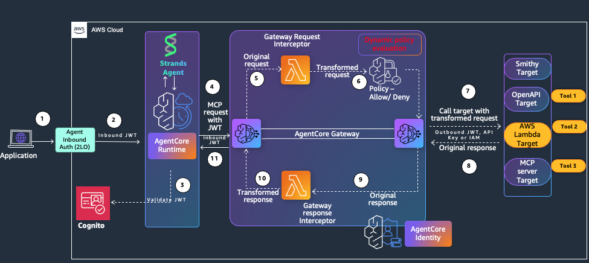
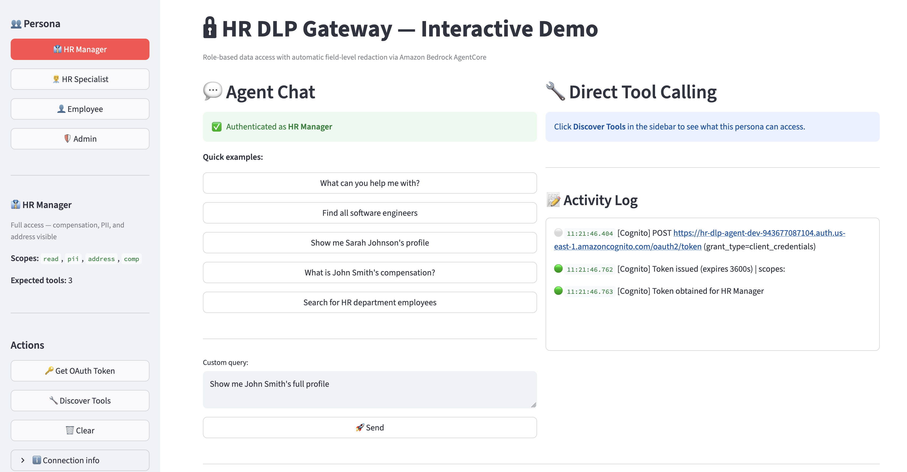
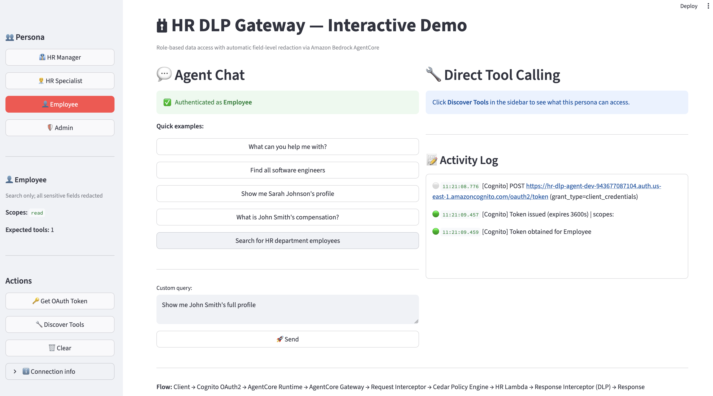

# Role-Based HR Data Agent

> [!IMPORTANT]
> This sample is for experimental and educational purposes only. It demonstrates concepts and techniques but is not intended for direct use in production environments.

> [!IMPORTANT]
> This sample uses synthetic HR data for demonstration purposes only. No real employee data is processed.

**Important:**
- This application **is not intended** for direct use in production environments.
- The code and architecture presented here are examples and may not meet all security, scalability, or compliance requirements for your specific use case.
- Before deploying any similar system in a production environment, it is crucial to:
  - Conduct thorough testing and security audits
  - Ensure compliance with all relevant regulations and industry standards
  - Optimize for your specific performance and scalability needs
  - Implement proper error handling, logging, and monitoring
  - Follow all AWS best practices for production deployments

## Overview

A role-based HR data access agent with automatic **scope-based field redaction** using Amazon Bedrock AgentCore. The agent enforces fine-grained data access policies based on each caller's OAuth 2.0 scopes — without changing application code.

**Key Capabilities:**
- **Field-Level Data Loss Prevention (DLP)**: Automatically redacts sensitive fields (salary, email, address) based on caller's OAuth scopes
- **Role-Based Access Control**: Four personas (HR Manager, HR Specialist, Employee, Admin) with different permission levels
- **Cedar Authorization**: Policy-based tool access control evaluated at the Gateway
- **Multi-Tenant Isolation**: Tenant context automatically injected from OAuth client ID
- **Request/Response Interception**: JWT decoding and field redaction via Lambda interceptors
- **Amazon Cognito OAuth 2.0**: Client credentials flow with custom scopes per persona

**Architecture Components:**
- **Amazon Bedrock AgentCore Runtime** — hosts the Strands Agent; receives user prompts and orchestrates MCP tool calls
- **Amazon Bedrock AgentCore Gateway** — central policy enforcement point with JWT authentication, Cedar policies, and Lambda interceptors
- **Request Interceptor Lambda** — decodes JWT, injects tenant context into every tool call
- **Cedar Policy Engine** — evaluates Allow/Deny decisions per tool based on OAuth scopes
- **Response Interceptor Lambda** — applies field-level redaction and filters tool discovery
- **HR Data Provider Lambda** — MCP server providing three tools: search_employee, get_employee_profile, get_employee_compensation



| # | Step |
|---|---|
| 1 | Application sends a prompt to AgentCore Runtime with an inbound auth token |
| 2 | Runtime obtains a scoped JWT from Cognito (`client_credentials` flow) |
| 3 | Strands Agent sends an MCP request (`tools/list` or `tools/call`) to AgentCore Gateway with the JWT in the header |
| 4 | Gateway forwards the request to the **Request Interceptor Lambda** |
| 5 | Request Interceptor decodes the JWT, injects `tenantId` into tool arguments, and returns the transformed request |
| 6 | Gateway evaluates the **Cedar Policy Engine** — Allow or Deny based on OAuth scopes |
| 7 | Gateway calls the **Lambda target** (HR Data Provider) with the transformed request, using AgentCore Identity for outbound auth |
| 8 | Lambda returns the full (unredacted) response |
| 9 | Gateway passes the response to the **Response Interceptor Lambda** |
| 10 | Response Interceptor applies field-level redaction and filters tool discovery by scope; transformed response returned to the Runtime |

## Demo

| HR Manager — full access | Employee — all sensitive fields redacted |
|:---:|:---:|
|  |  |

> Same query, same agent, different OAuth scopes — field redaction applied automatically by the Response Interceptor.

> See [per-persona request flow](docs/diagrams/flow.md) for a detailed sequence diagram with per-persona field redaction steps.

## Reference

### Scope → Field Mapping

The Lambda target returns full unredacted records for every caller. The Response Interceptor applies field-level redaction based on the caller's OAuth scopes — sensitive fields are withheld from the agent and the user unless the persona has explicit permission. This mapping is defined in `_redact_employee()` in [`prerequisite/lambda/interceptors/response_interceptor.py`](prerequisite/lambda/interceptors/response_interceptor.py). To extend redaction to other data sources (DynamoDB, RDS, S3), update the field lists in that function — the Gateway interceptor pattern applies identically regardless of what the Lambda target reads from.

| Scope | Redacted fields |
|---|---|
| `hr-dlp-gateway/pii` | email, phone, personal_phone, emergency_contact |
| `hr-dlp-gateway/address` | address, city, state, zip_code |
| `hr-dlp-gateway/comp` | salary, bonus, stock_options, pay_grade, benefits_value, compensation_history |

### Persona Access Matrix

Step 2 (`prereq.sh`) creates a Cognito User Pool with a resource server (`hr-dlp-gateway`) that defines four custom OAuth scopes — `read`, `pii`, `address`, and `comp` — and provisions one app client per persona with a fixed `AllowedOAuthScopes` list. Each persona gets a `client_id` and `client_secret` stored in SSM; the agent fetches a token via `client_credentials` flow using those credentials. The Gateway enforces what tools are visible and what fields are returned based on the scopes present in the token.

| Persona | Scopes | Tools visible | Salary | Email | Address |
|---|---|---|---|---|---|
| HR Manager | read, pii, address, comp | 3 | Visible | Visible | Visible |
| HR Specialist | read, pii | 2 | `[REDACTED]` | Visible | `[REDACTED]` |
| Employee | read | 1 | `[REDACTED]` | `[REDACTED]` | `[REDACTED]` |
| Admin | read, pii, address, comp | 3 | Visible | Visible | Visible |

## Prerequisites

**AWS Requirements:**
- AWS account with Amazon Bedrock AgentCore access
- AWS CLI configured with administrator access (or IAM permissions for Lambda, Cognito, AgentCore, IAM, S3, SSM)
- **Supported Region**: `us-east-1` (Amazon Bedrock AgentCore availability)
- **Claude Haiku 4.5** model access enabled in Amazon Bedrock via cross-region inference (CRIS)
  - Navigate to [Amazon Bedrock Console](https://console.aws.amazon.com/bedrock/)
  - Go to "Model access" and enable Claude Haiku 4.5

**Development Environment:**
- Python 3.10 or higher
- [uv](https://docs.astral.sh/uv/) (recommended) or pip
- Git (to clone the repository)

## Quick Start

### Step 1: Clone and install dependencies

```bash
git clone https://github.com/awslabs/agentcore-samples.git
cd agentcore-samples/02-use-cases/role-based-hr-data-agent

# Option A: Using uv (recommended)
uv sync

# Option B: Using pip
pip install -r requirements.txt
```

### Step 2: Deploy prerequisites

Packages Lambda functions and deploys CloudFormation stacks for Lambda, IAM, and Cognito. Stores all resource IDs in SSM under `/app/hrdlp/*`.

```bash
bash scripts/prereq.sh --region us-east-1 --env dev
```

### Step 3: Deploy Amazon Bedrock AgentCore infrastructure

Package the runtime agent and deploy Gateway, GatewayTarget, Cedar Policy Engine, and Runtime via CloudFormation (~5-6 minutes):

```bash
bash scripts/package_runtime.sh
bash scripts/deploy_cfn.sh us-east-1 dev
```

**What this deploys:**
- **1 Amazon Bedrock AgentCore Gateway** with JWT authentication and Lambda interceptors
- **1 GatewayTarget** (Lambda MCP server with 3 HR tools: search_employee, get_employee_profile, get_employee_compensation)
- **1 Cedar Policy Engine** with 3 authorization policies (default: LOG_ONLY mode)
- **1 Amazon Bedrock AgentCore Runtime** (Strands agent)
- All resource IDs written to AWS Systems Manager Parameter Store (`/app/hrdlp/*`)

**Cedar Policy Modes:**
- `LOG_ONLY` (default): Policies log decisions but do not block requests
- `ENFORCE`: Policies block unauthorized requests

To deploy in ENFORCE mode:
```bash
bash scripts/deploy_cfn.sh us-east-1 dev ENFORCE
```

### Step 4: Run the Streamlit app

```bash
streamlit run app.py
```

Open http://localhost:8501. Select a persona, click **Get OAuth Token**, then ask a question such as *"Show me John Smith's compensation"*. Switch personas to see field redaction applied automatically.

---

### Alternative: Manual boto3 deployment (legacy)

<details>
<summary>Click to expand legacy 5-step boto3 deployment</summary>

If you need to deploy AgentCore resources individually via boto3 instead of CloudFormation:

**Step 3a: Create the AgentCore Gateway**

```bash
python scripts/agentcore_gateway.py create --config prerequisite/prereqs_config.yaml
```

**Step 3b: Create the Cedar Policy Engine**

```bash
python scripts/create_cedar_policies.py --region us-east-1 --env dev
```

Default mode is `LOG_ONLY`. Switch to enforcement:

```bash
python scripts/create_cedar_policies.py --mode ENFORCE
```

**Step 3c: Deploy the AgentCore Runtime**

```bash
bash scripts/package_runtime.sh

BUCKET=$(aws ssm get-parameter --name /app/hrdlp/deploy-bucket --query Parameter.Value --output text)
aws s3 cp dist/runtime.zip s3://${BUCKET}/hr-data-agent/runtime.zip

python scripts/agentcore_agent_runtime.py create
```

> **Note:** The boto3 scripts (`agentcore_gateway.py`, `create_cedar_policies.py`, `agentcore_agent_runtime.py`) are maintained for backwards compatibility and advanced use cases. The CloudFormation approach (Step 3 above) is recommended for most deployments.

</details>

## Testing

> **Note:** Cedar defaults to `LOG_ONLY` mode — policies log decisions but do not block requests. Tests are expected to pass in either mode; switch to `ENFORCE` only when ready for production.

### Quick validation (20 tests)

Validates the full CloudFormation deployment across all personas:

```bash
bash run_quick_validation.sh
```

Expected: `20/20 PASS` — verifies Gateway, Runtime, interceptors, Cedar policies, and role-based access control.

### Verify field redaction

```bash
python test/test_dlp_redaction.py
```

Expected output:

```
Testing persona: hr-manager      →  PASS  (salary visible, email visible)
Testing persona: hr-specialist   →  PASS  (salary redacted, email visible)
Testing persona: employee        →  PASS  (salary redacted, email redacted)
Testing persona: admin           →  PASS  (salary visible, email visible)
```

### Test the full agent

```bash
python test/test_agent.py --persona hr-manager --prompt "Show me John Smith's compensation"
python test/test_agent.py --persona employee --prompt "Show me John Smith's compensation"
```

### Test the Gateway directly

```bash
python test/test_gateway.py --persona hr-manager --list-tools
python test/test_gateway.py --persona employee --list-tools
python test/test_gateway.py --persona hr-specialist --query "Sarah Johnson"
```

### View CloudWatch logs

```bash
ENV=dev
aws logs tail /aws/lambda/hr-data-provider-lambda-${ENV} --since 1h --follow
aws logs tail /aws/lambda/hr-request-interceptor-lambda-${ENV} --since 1h --follow
aws logs tail /aws/lambda/hr-response-interceptor-lambda-${ENV} --since 1h --follow
```

## Troubleshooting

**CloudFormation stack fails to create**
Check CloudFormation Events in the AWS console for detailed error messages. Common causes:
- Missing prerequisites: Ensure Step 2 (`prereq.sh`) completed successfully
- SSM parameters missing: `aws ssm get-parameters-by-path --path /app/hrdlp --recursive`
- Region mismatch: Gateway, Runtime, and Lambda must be in the same region
- **PropertyValidation error**: Gateway names must use hyphens (not underscores), Runtime names must use underscores (not hyphens). See `CLOUDFORMATION_MIGRATION_SUMMARY.md` for details.

**Runtime `CREATE_FAILED` — ARM64 binary incompatibility**
macOS packaging pulled darwin binaries. Delete the old zip and repackage:
```bash
rm -f dist/runtime.zip && bash scripts/package_runtime.sh
```

**SSM parameters missing when running the app**
Complete Steps 2–3 first. Verify all parameters are present:
```bash
aws ssm get-parameters-by-path --path /app/hrdlp --recursive --query "Parameters[].Name" --output text
```

**Cedar policy failures (LOG_ONLY mode)**
Cedar defaults to `LOG_ONLY` — policies log decisions but do not block requests. To enforce:
```bash
bash scripts/deploy_cfn.sh us-east-1 dev ENFORCE
```

**Stale Runtime exists before create**
`cleanup_cfn.sh` can miss runtimes. Verify before redeploying:
```bash
aws bedrock-agentcore-control list-agent-runtimes --region us-east-1
```

---

### Troubleshooting (legacy boto3 deployment)

<details>
<summary>Click to expand legacy troubleshooting</summary>

**Cedar `CREATE_FAILED: An internal error occurred during creation`**
Cedar's schema initialization failed — usually the engine is in a corrupted state from a prior failed run. Clean up and redeploy from Step 2:
```bash
bash scripts/cleanup.sh && bash scripts/prereq.sh --region us-east-1 --env dev
```

**Cedar `CREATE_FAILED: unable to find at offset 0`**
No Lambda target is registered. Complete Step 3 before running Step 4.
```bash
python scripts/agentcore_gateway.py create --config prerequisite/prereqs_config.yaml
```

**Runtime returns 403 after update**
`update-agent-runtime` resets fields not explicitly passed. Run the full update command:
```bash
python scripts/agentcore_agent_runtime.py update
```

</details>

## Project Structure

```
role-based-hr-data-agent/
├── agent_config/          # HRDataAgent — Strands + MCP/JSON-RPC
├── app_modules/           # Streamlit UI (auth, chat, persona selector)
├── docs/
│   ├── screenshots/       # Demo screenshots + full architecture diagram
│   └── diagrams/          # Per-persona request flow (flow.md)
├── scripts/               # Deployment CLI (gateway, runtime, Cedar, Cognito)
├── prerequisite/
│   ├── lambda/            # HR Data Provider + Request/Response Interceptors
│   ├── cedar/             # Cedar authorization policies
│   ├── infrastructure.yaml
│   └── cognito.yaml
├── test/                  # Gateway, agent, and field redaction tests
├── app.py                 # Streamlit entry point
├── main.py                # AgentCore Runtime entry point
└── requirements.txt
```

## Cleanup

**If deployed via CloudFormation (Step 3 — recommended):**

```bash
# Delete AgentCore infrastructure (Gateway, GatewayTarget, Runtime, Cedar policies)
bash scripts/cleanup_cfn.sh us-east-1 dev

# Delete prerequisites (Lambda, Cognito, IAM, S3)
bash scripts/cleanup.sh --region us-east-1 --env dev
```

**If deployed via boto3 (legacy manual deployment):**

```bash
bash scripts/cleanup.sh --region us-east-1 --env dev
```

> **Note (macOS / Windows):** After cleanup, the Cognito User Pool Domain (`hr-dlp-agent-*`) can take 30–60 seconds to fully de-register in AWS's DNS layer. If you immediately re-run `prereq.sh` and the Cognito stack fails with `Internal error reported from downstream service during operation 'CreateUserPoolDomain'`, wait 30 seconds and retry:
> ```bash
> aws cloudformation delete-stack --stack-name hr-dlp-cognito-dev
> aws cloudformation wait stack-delete-complete --stack-name hr-dlp-cognito-dev
> # wait 30 seconds, then:
> bash scripts/prereq.sh --region us-east-1 --env dev
> ```

## Contributing

We welcome contributions! See [Contributing Guidelines](../../CONTRIBUTING.md) for details.

## License

MIT License — see [LICENSE](../../LICENSE).

## Support

Report issues via [GitHub Issues](https://github.com/awslabs/agentcore-samples/issues).
