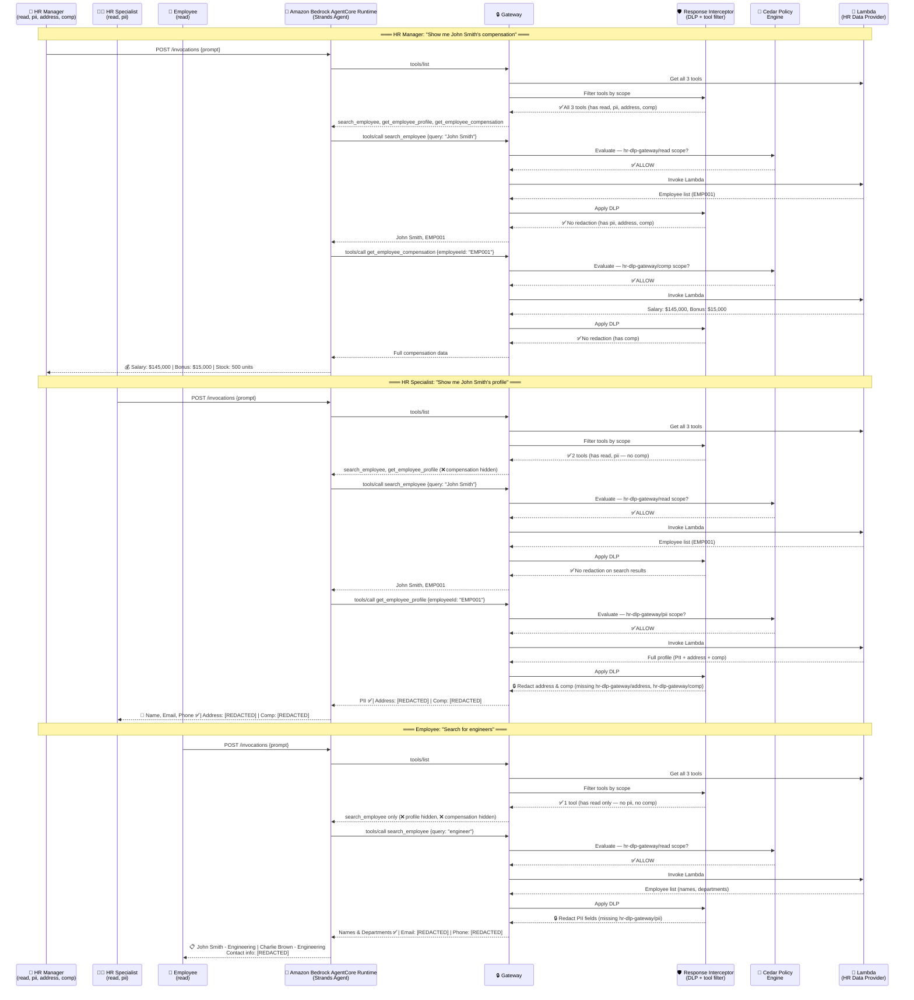

# DLP Gateway — Request Flow by Persona

```mermaid
sequenceDiagram
    participant HRM as 👔 HR Manager<br/>(read, pii, address, comp)
    participant HRS as 👨‍💼 HR Specialist<br/>(read, pii)
    participant EMP as 👤 Employee<br/>(read)
    participant RT as 🤖 Amazon Bedrock AgentCore Runtime<br/>(Strands Agent)
    participant GW as 🔒 Gateway
    participant RI as 🛡️ Response Interceptor<br/>(DLP + tool filter)
    participant CP as 📜 Cedar Policy<br/>Engine
    participant LM as 💾 Lambda<br/>(HR Data Provider)

    Note over HRM,LM: ═══ HR Manager: "Show me John Smith's compensation" ═══

    HRM->>RT: POST /invocations {prompt}
    RT->>GW: tools/list
    GW->>LM: Get all 3 tools
    GW->>RI: Filter tools by scope
    RI-->>GW: ✅ All 3 tools (has read, pii, address, comp)
    GW-->>RT: search_employee, get_employee_profile, get_employee_compensation

    RT->>GW: tools/call search_employee {query: "John Smith"}
    GW->>CP: Evaluate — hr-dlp-gateway/read scope?
    CP-->>GW: ✅ ALLOW
    GW->>LM: Invoke Lambda
    LM-->>GW: Employee list (EMP001)
    GW->>RI: Apply DLP
    RI-->>GW: ✅ No redaction (has pii, address, comp)
    GW-->>RT: John Smith, EMP001

    RT->>GW: tools/call get_employee_compensation {employeeId: "EMP001"}
    GW->>CP: Evaluate — hr-dlp-gateway/comp scope?
    CP-->>GW: ✅ ALLOW
    GW->>LM: Invoke Lambda
    LM-->>GW: Salary: $145,000, Bonus: $15,000
    GW->>RI: Apply DLP
    RI-->>GW: ✅ No redaction (has comp)
    GW-->>RT: Full compensation data
    RT-->>HRM: 💰 Salary: $145,000 | Bonus: $15,000 | Stock: 500 units

    Note over HRM,LM: ═══ HR Specialist: "Show me John Smith's profile" ═══

    HRS->>RT: POST /invocations {prompt}
    RT->>GW: tools/list
    GW->>LM: Get all 3 tools
    GW->>RI: Filter tools by scope
    RI-->>GW: ✅ 2 tools (has read, pii — no comp)
    GW-->>RT: search_employee, get_employee_profile (❌ compensation hidden)

    RT->>GW: tools/call search_employee {query: "John Smith"}
    GW->>CP: Evaluate — hr-dlp-gateway/read scope?
    CP-->>GW: ✅ ALLOW
    GW->>LM: Invoke Lambda
    LM-->>GW: Employee list (EMP001)
    GW->>RI: Apply DLP
    RI-->>GW: ✅ No redaction on search results
    GW-->>RT: John Smith, EMP001

    RT->>GW: tools/call get_employee_profile {employeeId: "EMP001"}
    GW->>CP: Evaluate — hr-dlp-gateway/pii scope?
    CP-->>GW: ✅ ALLOW
    GW->>LM: Invoke Lambda
    LM-->>GW: Full profile (PII + address + comp)
    GW->>RI: Apply DLP
    RI-->>GW: 🔒 Redact address & comp (missing hr-dlp-gateway/address, hr-dlp-gateway/comp)
    GW-->>RT: PII ✅ | Address: [REDACTED] | Comp: [REDACTED]
    RT-->>HRS: 👤 Name, Email, Phone ✅ | Address: [REDACTED] | Comp: [REDACTED]

    Note over HRM,LM: ═══ Employee: "Search for engineers" ═══

    EMP->>RT: POST /invocations {prompt}
    RT->>GW: tools/list
    GW->>LM: Get all 3 tools
    GW->>RI: Filter tools by scope
    RI-->>GW: ✅ 1 tool (has read only — no pii, no comp)
    GW-->>RT: search_employee only (❌ profile hidden, ❌ compensation hidden)

    RT->>GW: tools/call search_employee {query: "engineer"}
    GW->>CP: Evaluate — hr-dlp-gateway/read scope?
    CP-->>GW: ✅ ALLOW
    GW->>LM: Invoke Lambda
    LM-->>GW: Employee list (names, departments)
    GW->>RI: Apply DLP
    RI-->>GW: 🔒 Redact PII fields (missing hr-dlp-gateway/pii)
    GW-->>RT: Names & Departments ✅ | Email: [REDACTED] | Phone: [REDACTED]
    RT-->>EMP: 📋 John Smith - Engineering | Charlie Brown - Engineering<br/>Contact info: [REDACTED]
```
